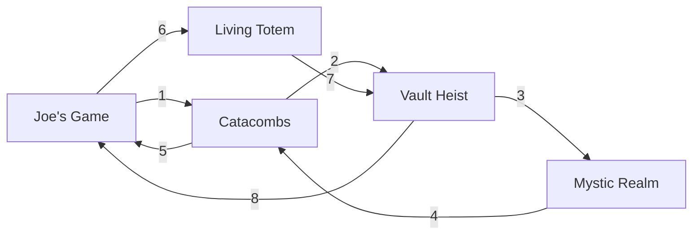

<div align="center"><h1>Kotevents</h1></div>

In the game [King of Thieves](https://www.kingofthieves.com/), there are certain events where players can earn rewards. These events repeat every so often, each lasting 3 days. I became curious to know if there was a predefined sequence for these events or if they were random.

That's when I decided to apply [n-grams](https://en.wikipedia.org/wiki/N-gram) to the event names to try to predict the next upcoming event. After several months of recording events, I concluded that the events follow a predefined sequence, which can be seen at Figure 1, since the probabilities when considering 4 previous events always resulted in ``1.0``.


<div align="center"><p><i>Figure 1. Event cycle within the game, length 8</i></p></div>

The `main.py` script is based on the list of events in `events.txt`, where the first lines are the oldest events and the last lines are the most recent. If you want to try to predict the next event taking into account n previous events, the value of the parameter n should be `n+1`:

```bash
$n = 1 # example
python main.py predict -n $(($n+1))
```

If you want to predict the next event, you need to add the predicted event from the previous command to the list. For example, if you got this result:
```
Using n-gram of size n=2
Historical events loaded: 26
Context used: ('catacombs',)
Conditional probabilities:  
  joe's game: 0.600
  vault heist: 0.400        
Prediction: joe's game 
```

You could try to add `joe's game` to the list and then predict again:
```bash
python main.py add "joe's game"
python main.py predict -n 2
```
