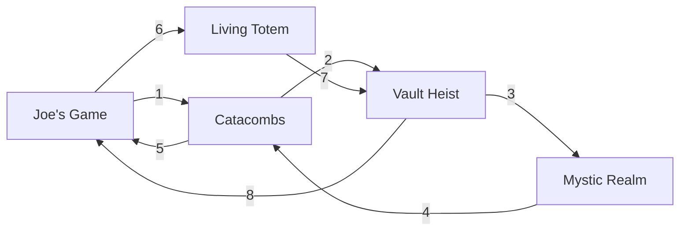

<div align="center"><h1>Kotevents</h1></div>

En el juego [King of Thieves](https://www.kingofthieves.com/) hay ciertos eventos donde los jugadores pueden obtener recompensas y se repiten cada cierto tiempo, durando cada uno 3 dias. Me dió curiosidad por saber si existía una secuencia predefinida para dichos eventos o si eran aleatorios.

Fue entonces cuando se me ocurrió aplicar [n-gramas](https://en.wikipedia.org/wiki/N-gram) sobre los nombres de los eventos para intentar predecir el siguiente evento que se iba a producir. Tras varios meses apuntando eventos, llegué a la conclusion de que los eventos seguian una secuencia predefinida, la cual se puede ver a continuación, debido a que las probabilidades al tener en cuenta 4 eventos anteriores siempre resultaban en ``1.0``.


<div align="center"><p><i>Figura 1. Ciclo de eventos dentro del juego, de longitud 8</i></p></div>

El script `main.py` se basa en la lista de eventos `events.txt`, donde las primeras lineas son los eventos mas antiguos y las ultimas lineas a los mas recientes. Si quieres intentar predecir el siguiente evento teniendo en cuenta n eventos anteriores, el valor del parametro n ha de ser `n+1`:

```bash
$n = 1 # example
python main.py predict -n $(($n+1))
```

Si quieres predecir el siguiente, has de anadir el evento predecido en el comando anterior a la lista. Por ejemplo si obtiviste este resultado:
```
Using n-gram of size n=2
Historical events loaded: 26
Context used: ('catacombs',)
Conditional probabilities:  
  joe's game: 0.600
  vault heist: 0.400        
Prediction: joe's game 
```

You could try to add the `joe's game` to the list and then predict again
```bash
python main.py add "joe's game"
python main.py predict -n 2
```
